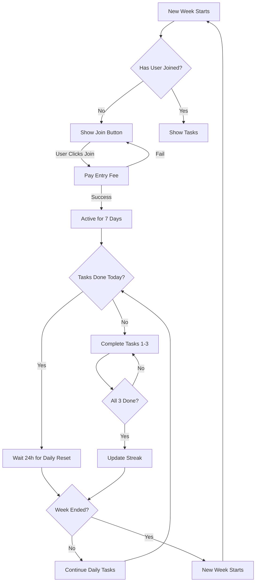

# 📅 Weekly System - How It Works

## Overview

Base Quest uses a **weekly cycle** system where users:
1. **Join once per week** (pay entry fee)
2. **Stay active all week** to complete daily tasks
3. **Wait for next week** when countdown ends

---

## ✅ The Correct Flow

### Week 1 Starts
```
┌─────────────────────────────────────┐
│  WEEK 1 - Day 1                     │
│  Countdown: 6 days, 23 hours left   │
└─────────────────────────────────────┘

User Action: Click "Join This Week"
├─ Pay 0.00001 ETH entry fee
└─ Status: Active for entire Week 1
```

### Throughout Week 1 (Days 1-7)
```
User stays active and can:
├─ Complete 3 tasks daily
├─ Earn Base Points
├─ Maintain streak
└─ Compete on leaderboard

NO need to join again!
✅ Already joined, stay active all week
```

### Week 1 Ends → Week 2 Starts
```
┌─────────────────────────────────────┐
│  Countdown: 0 days, 0 hours         │
│  Week 1 ends, Week 2 begins!        │
└─────────────────────────────────────┘

Contract: _startNewWeek() called
├─ Distribute rewards to top 10%
├─ Reset activePlayers array
├─ Reset activeThisWeek flags
└─ Increment currentWeek

User Status: INACTIVE for Week 2
Action Required: Join Week 2 (pay entry fee again)
```

---

## 🔄 Key Concepts

### 1. **One Join Per Week**
- Users pay the entry fee **ONCE** per week
- This gives them access for the **ENTIRE 7-day period**
- They can complete daily tasks every day during that week

### 2. **Daily Task Reset**
- Every 24 hours, `tasksCompletedToday` resets to 0
- Users get 3 new task slots each day
- They must complete all 3 to maintain their streak

### 3. **Week Countdown Timer**
- Shows time remaining in current week
- Always visible and counting down
- When it reaches zero, new week starts

### 4. **State Variables**

| Variable | Scope | Reset Time | Purpose |
|----------|-------|------------|---------|
| `currentWeek` | Global | When admin calls `endWeekAndDistribute()` | Current week number |
| `weeklyParticipation[week][player]` | Per week | Never (permanent record) | Did player join this specific week? |
| `activeThisWeek` | Per player | At week end | Is player active in current week? |
| `tasksCompletedToday` | Per player | Every 24 hours | Daily task counter (0-3) |
| `weeklyBasePoints` | Per player | At week end | Points earned this week |

---

## 🚫 Common Misconceptions

### ❌ WRONG: "I need to join every day"
**✅ CORRECT:** Join once per week, complete tasks daily

### ❌ WRONG: "I can't do tasks after joining"
**✅ CORRECT:** Joining unlocks tasks for the entire week

### ❌ WRONG: "The countdown is broken"
**✅ CORRECT:** Countdown shows week end, not daily reset

---

## 💡 User Journey Example

### Monday - Week 1 Starts
```
09:00 AM - User joins Week 1 (pays 0.00001 ETH)
10:00 AM - Completes task 1 ✅
11:00 AM - Completes task 2 ✅
12:00 PM - Completes task 3 ✅
Status: 3/3 tasks done for Monday
```

### Tuesday - Same Week
```
User is STILL active (no new join needed)
09:00 AM - Daily reset occurs
10:00 AM - Completes task 1 ✅
11:00 AM - Completes task 2 ✅
12:00 PM - Completes task 3 ✅
Status: 3/3 tasks done for Tuesday
```

### Wednesday - Same Week
```
User is STILL active
... continues daily tasks ...
```

### Next Monday - Week 2 Starts
```
User sees: "Join Week 2"
Action: Must join again (pay entry fee)
Then: Can complete tasks for entire Week 2
```

---

## 🔧 Technical Implementation

### Contract Logic

```solidity
function joinWeek() external payable {
    // Prevent duplicate joins in same week
    require(!weeklyParticipation[currentWeek][msg.sender], "Already joined this week");
    
    // Mark player as active
    weeklyParticipation[currentWeek][msg.sender] = true;
    players[msg.sender].activeThisWeek = true;
    
    // Player stays active until week ends
}

function _startNewWeek() internal {
    // Reset all players to inactive
    for (uint256 i = 0; i < activePlayers.length; i++) {
        players[activePlayers[i]].activeThisWeek = false;
    }
    
    currentWeek++; // New week begins
}
```

### Frontend Logic

```typescript
// UI shows different screens based on status
{!playerData?.activeThisWeek ? (
  // Not joined yet - show "Join Week" button
  <JoinWeekScreen />
) : (
  // Already active - show tasks
  <TaskList />
)}
```

---

## 📊 State Transitions



---

## 🎯 User Experience Goals

### What Users Should Understand
1. ✅ Join once per week (one-time payment)
2. ✅ Complete 3 tasks daily to maintain streak
3. ✅ Week countdown shows when new week starts
4. ✅ Must rejoin when new week begins

### Clear UI Messaging
- **Join Screen:** "Pay once to join this week's challenge"
- **Tasks Complete:** "Come back in 24 hours for new tasks"
- **Week Timer:** "New week starts when timer reaches zero"
- **Error Message:** "You're already in! Complete tasks until week ends"

---

## 🐛 Troubleshooting

### "Already joined this week" Error

**Scenario:** User clicks "Join This Week" and gets error

**Possible Causes:**
1. ✅ **Expected:** User already joined and is active
   - **Solution:** UI should show tasks, not join button
   - **Action:** Refresh page or check `activeThisWeek` flag

2. ❌ **Bug:** `activeThisWeek` not reset when new week starts
   - **Solution:** Fixed in contract's `_startNewWeek()`
   - **Action:** Redeploy contract

### Users See Join Button When They Shouldn't

**Cause:** Frontend `playerData.activeThisWeek` is false but user joined

**Debug:**
```bash
npx hardhat run scripts/debugPlayer.cjs --network base-sepolia
```

**Check Output:**
- `hasJoinedCurrentWeek: true` ✅
- `isActiveThisWeek: true` ✅
- Both should be true if joined

---

## 📝 Summary

| Action | Frequency | Cost | Result |
|--------|-----------|------|--------|
| Join Week | Once per week | 0.00001 ETH | Active for 7 days |
| Complete Tasks | 3 per day | Free | Earn BP & maintain streak |
| Daily Reset | Every 24 hours | Automatic | New task slots available |
| Week End | Every 7 days | Automatic | Rewards distributed, new week starts |

**Remember:** The system is designed for **weekly participation** with **daily engagement**, not daily joining!
